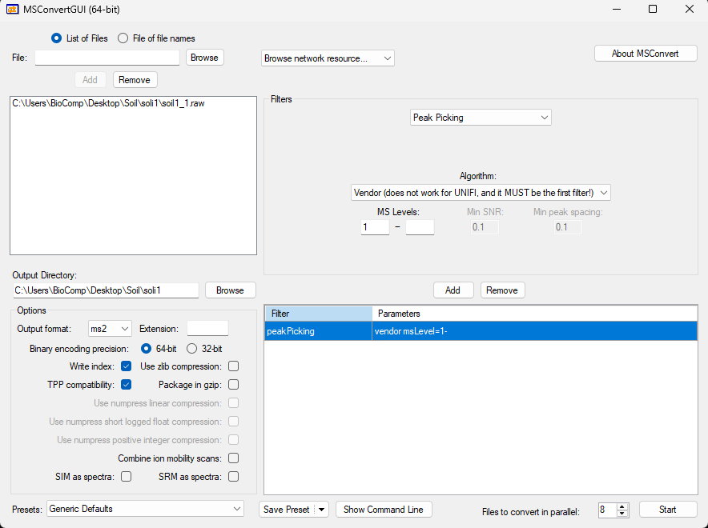

# Data Folder

This folder contains references and instructions for accessing and processing the datasets used in the manuscript associated with this repository.

## Overview

The datasets include multiple metaproteomic studies used for training, validation, and benchmarking. The raw MS files were converted using **MSConvertGUI (64-bit)**, with configuration parameters detailed below.

All datasets comply with FAIR principles through the use of persistent identifiers, open-access repositories, and standard formats for mass spectrometry data.

---

## 📁 Dataset List (with File Names and URLs)

### 1. **ProteomeTools Dataset (Easy phase)**

- **Training Data:**  
  File: `Prosit_training_PSMs.tsv`  
  URL: https://figshare.com/articles/dataset/Datasets/25511770

- **Validation Data:**  
  File: `Prosit_validation_PSMs.tsv`  
  URL: https://figshare.com/articles/dataset/Datasets/25511770

- **Spectra Files:**  
  - `PXD010595`: https://ftp.pride.ebi.ac.uk/pride/data/archive/2019/05/PXD010595/  
  - `PXD004732`: https://ftp.pride.ebi.ac.uk/pride/data/archive/2017/02/PXD004732/

---

### 2. **Marine 1 Dataset (Difficult phase)**

- **Training Data:**  
  File: `marine1_training.tsv`  
  URL: https://figshare.com/articles/dataset/Datasets/25511770

- **Validation Data:**  
  File: `marine1_validation.tsv`  
  URL: https://figshare.com/articles/dataset/Datasets/25511770

- **Spectra Files:**  
  URL: https://ftp.pride.ebi.ac.uk/pride/data/archive/2018/02/PXD007587/

---

### 3. **Marine Metaproteomes**

- **Protein Database:**  
  File: `Marine_shuffled.fasta`  
  URL: https://figshare.com/articles/dataset/Protein_databases/29142830

- **Raw MS Files:**
  - Marine 1: filenames start with `OSU_D10_FASP_Elite_0320201`
  - Marine 2: filenames start with `OSU_D2_FASP_Elite_02262014`
  - Marine 3: filenames start with `OSU_D7_FASP_Elite_03172014`

  URL: https://ftp.pride.ebi.ac.uk/pride/data/archive/2018/02/PXD007587/

---

### 4. **Soil Metaproteomes**

- **Protein Database:**  
  File: `Soil_shuffled.fasta`  
  URL: https://figshare.com/articles/dataset/Protein_databases/29142830

- **Raw MS Files:**
  - Soil 1: filenames start with `Angelo_08202013_P1_3040cm_MB_FASP_Elite`
  - Soil 2: filenames start with `Angelo_09272013_P1_1020cm_MB_FASP_Elite`
  - Soil 3: filenames start with `Angelo_10022013_P1_3040cm_MB_FASP_Elite`

  URL: https://ftp.pride.ebi.ac.uk/pride/data/archive/2018/02/PXD007587/

---

### 5. **Mock Community Metaproteomes**

- **Protein Database:**  
  File: `Mock_Comm_RefDB_V3_shuffled.fasta`  
  URL: https://figshare.com/articles/dataset/Protein_databases/29142830

- **Raw MS Files:**
  - P1: filenames start with `P1_run3`
  - P2: filenames start with `P2_run3`
  - P3: filenames start with `P3_run3`

  URL: https://ftp.pride.ebi.ac.uk/pride/data/archive/2017/05/PXD006118/

---

### 6. **Human Gut Metaproteome (HG)**

- **Protein Database:**  
  File: `stool_nrnew_shuffled.fasta`  
  URL: https://figshare.com/articles/dataset/Protein_databases/29142830

- **Raw MS Files:**  
  `cdj-DDA1.raw`, `cdj-DDA2.raw`, `cdj-DDA3.raw`, `cdj-DDA4.raw`, `cdj-DDA5.raw`,  
  `cdj-DDA6.raw`, `cdj-DDA7.raw`, `cdj-DDA8.raw`, `cdj-DDA9.raw`, `cdj-DDA10.raw`

  URL: https://www.iprox.cn/page/ProjectFileList.html?projectId=IPX0001564000

---

### 7. **Human Gut timsTOF (HGT)**

- **Protein Database:**  
  File: `GUT_DB2MG_shuffled.fasta`  
  URL: https://figshare.com/articles/dataset/Protein_databases/29142830

- **Raw MS Files:**  
  `F08_Rep1.raw`, `F08_Rep2.raw`, `F08_Rep3.raw`

  URL: https://ftp.pride.ebi.ac.uk/pride/data/archive/2022/02/PXD023217/

---

### 8. **Synthetic Microbial Mixture**

- **Protein Database:**  
  File: `synthetic.fasta`  
  URL: https://figshare.com/articles/dataset/Protein_databases/29142830

- **Raw MS Files:**  
  Filenames start with `P1_run3`  
  URL: https://ftp.pride.ebi.ac.uk/pride/data/archive/2017/05/PXD006118/

---

## 🔧 MSConvert Settings

Raw MS data were converted using **MSConvertGUI (v64-bit)** with the following configuration:

- **Filter:** Peak Picking  
  - **Algorithm:** Vendor  
  - **MS Levels:** 1-  
- **Output Format:** `ms2`  
- **Precision:** 64-bit  
- **Compression:** zlib enabled, gzip packaging  
- **TPP Compatibility:** Enabled  
- **SIM/SRM as spectra:** Disabled  

MSConvert Configuration Screenshot:

---
